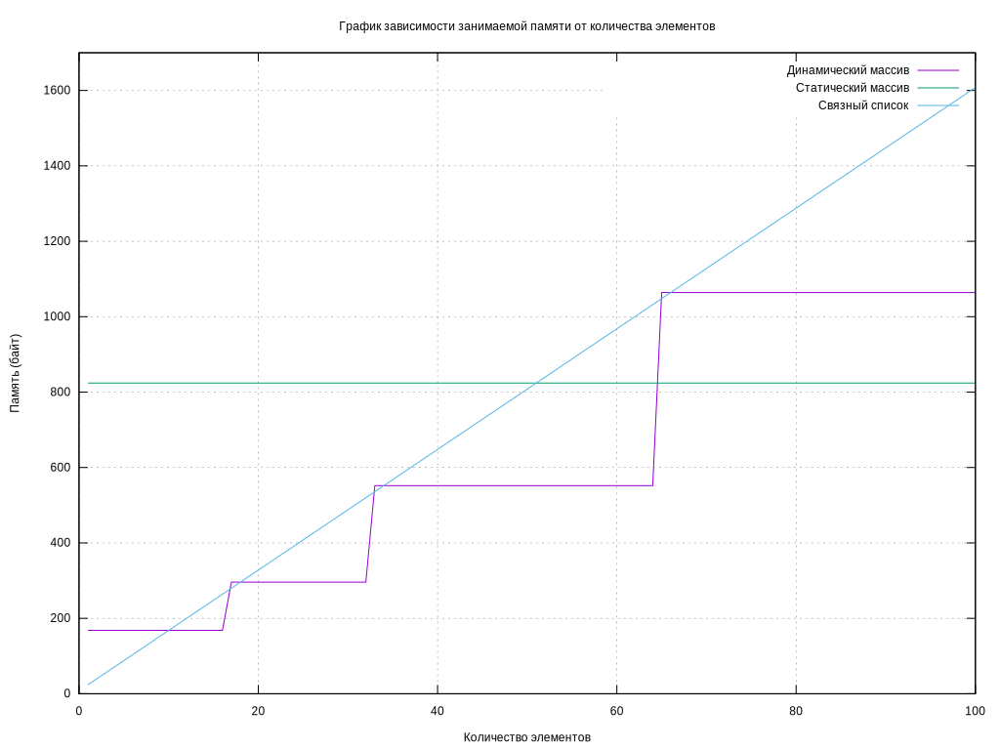

# Условие

Создать программу работы со стеком,
выполняющую операции добавления,
удаления элементов и вывод текущего
состояния стека. Реализовать стек:

- статическим массивом (дополнительно можно реализовать динамическим
  массивом);
- списком.

Все стандартные
операции со стеком должны быть
оформлены подпрограммами. При
реализации стека списком в вывод текущего
состояния стека добавить просмотр адресов
элементов стека и создать СВОЙ список или
массив свободных областей (адресов
освобождаемых элементов) с выводом его
на экран.

Элементами стека являются адреса памяти.
При реализации массивами - их вводить, при
реализации списком – брать адрес выделенной
памяти под элемент.

# 2. Описание ТЗ

## 2.1 Исходные данные и результаты

**Входные данные**

1) Значение элемента стека (адрес - целое положительное число)
2) Целое число — номер команды (от 0 до 10; См. [Описание задачи](#22-описание-задачи-реализуемой-программой));

**Выходные данны**

1) Извлеченный элемент из стека
2) Все элементы в стеке
3) Освобожденные из-под узлов списка адреса
4) Характеристика сравнения различных реализаций стека

## 2.2 Описание задачи, реализуемой программой

Программа реализует интерфейс для взаимодействия с разными реализациями структуры данных "стек", позволяющий выполнить
следующие действия:

> Номер перечисления соответствует номеру команды в программе

0) Выход
1) Добавить элемент в стек на списке (значение создается автоматически - это адрес очередного узла)
2) Извлечь верхний элемент из стека на списке
3) Отобразить содержимое стека на списке
4) Очистить стек на списке
5) Добавить элемент в стек на статическом массиве
6) Извлечь верхний элемент из стека на статическом массиве
7) Отобразить содержимое стека на статическом массиве
8) Очистить стек на статическом массиве
9) Добавить элемент в стек на динамическом массиве
10) Извлечь верхний элемент из стека на динамическом массиве
11) Отобразить содержимое стека на динамическом массиве
12) Очистить стек на динамическом массиве
13) Провести замеры

## 2.3 Способ обращения к программе

Взаимодействие с программой происходит через консольный интерфейс, входные данные вводятся пользователем с клавиатуры
Запуск программы из рабочей директории:

```shell
./app.exe
```

## 2.4 Описание возможных аварийных ситуаций и ошибок пользователя

Аварийные ситуации могут возникнуть только в случае невозможности выделения памяти.

> В программе предусмотренна защита от неправильного ввода, поэтому она не завершится аварийно в этом случае.

# 3. Внутренние структуры данных

> `item_t` - тип элемента стека (в данном случае `uintptr_t`)

Стек на списке

```c++
struct ll_node
{
    item_t val;
    struct ll_node *next;
};

typedef struct ll_node ll_node;

typedef struct
{
    ll_node *head;
} ll_stack;
```

---

Стек на статическом массиве

> MAX_LENGTH - максимальный размер статического массива (равно 100)

```c++
typedef struct
{
    size_t n;
    item_t data[MAX_LENGTH];
} array;

typedef struct
{
    array *body;
    item_t *head;
} sa_stack;
```

---

Стек на динамическом массиве

```c++
typedef struct
{
    size_t n;
    size_t n_reserved;
    item_t *data;
} dyn_arr;

typedef struct
{
    dyn_arr *body;
    item_t *head;
} da_stack;
```

> Начальная длина динамического массива - 16, при достижении максимального размера массив расширяется в 2 раза.

# 4. Описание алгоритма

**Добавление в статический массив**

1) Проверка если в массиве осталось место: если нет - ошибка
2) Запись нового элемента в массив
3) Перемещение указателя на вершину стека на новый элемент

**Извлечение из стека на статическом массиве**

1) Проверить, что массив не пуст: если пуст - ошибка
2) Записать значение последнего элемента
3) Уменьшить длину массива на 1
4) Переместить указатель на новый последний элемент
5) Вернуть записанное значение

---

**Добавление в связный список**

1) Создать новый узел
2) В поле next нового узла записать текущую вершину стека
3) Переместить указатель на вершину стека на новый узел

**Извлечение из стека на статическом массиве**

1) Проверить, что указатель на вершину не пуст - иначе ошибка
2) Записать значение вершины
3) Переместить указатель на вершины на поле next текущей вершины
4) Вернуть записанное значение

# 5. Основные функции

`return_code` - тип, описывающий код возврата\
`sa_stack` - тип, описывающий стек на статическом массиве (См. [структуры данных](#3-внутренние-структуры-данных))\
`da_stack` - тип, описывающий стек на динамическом массиве (См. [структуры данных](#3-внутренние-структуры-данных))\
`ll_stack` - тип, описывающий стек на связном списке (См. [структуры данных](#3-внутренние-структуры-данных))\
`dyn_array` - тип, описывающий динамический массив (См. [структуры данных](#3-внутренние-структуры-данных))\

---

Добавление в стек на статическом массиве

```c++
return_code process_sa_stack_push(sa_stack *stack);
```

---

Извлечение из вершины стека на статическом массиве

```c++
void process_sa_stack_pop(sa_stack *stack);
```

---

Вывод всего стека (стек на статическом массиве)

```c++
void process_sa_stack_show(const sa_stack *stack);
```

---

Очистка стека на статическом массиве

```c++
void process_sa_stack_clear(sa_stack *stack);
```

---

Добавление в стек на динамическом массиве

```c++
return_code process_da_stack_push(da_stack *stack);
```

---

Извлечение из вершины стека на динамическом массиве

```c++
void process_da_stack_pop(da_stack *stack);
```

---

Вывод всего стека (стек динамическом массиве)

```c++
void process_da_stack_show(const da_stack *stack);
```

---

Очистка стека на динамическом массиве

```c++
void process_da_stack_clear(da_stack *stack);
```

---

Добавление в стек на списке

```c++
return_code process_ll_stack_push(ll_stack *stack);
```

---

Извлечение из вершины стека на списке

```c++
void process_ll_stack_pop(ll_stack *stack, dyn_arr *freed_ptrs);
```

---

Вывод всего стека (стек на списке)

```c++
void process_ll_stack_show(const ll_stack *stack, const dyn_arr *freed_ptrs);
```

---

Очистка стека на списке

```c++
void process_ll_stack_clear(ll_stack *stack, dyn_arr *freed_ptrs);
```

---

Проведение замеров

```c++
void process_show_stat(sa_stack *sa_stack, da_stack *da_stack, ll_stack *ll_stack);
```

# 6. Оценка эффективности

Для каждой измеряемой операция выполнялась 100 раз, а затем время затраченное на 100 одинаковых операций делилось на
количество выполнений, чтобы получить время 1 операции

## Push (Добавление)

| Type          | Time (nanoseconds) |
|---------------|--------------------|
| Static array  | 20                 |
| Dynamic array | 430                |
| Linked list   | 70                 |

---

## Pop (Извлечение вершины)

| Type          | Time (nanoseconds) |
|---------------|--------------------|
| Static array  | 10                 |
| Dynamic array | 10                 |
| Linked list   | 40                 |

---

## Затраченная память



Можно заметить, что стеки на статическом массиве выполняются операции быстрее, для динамического массива же, операция
добавления выполняется с такой же скорость, если массив не нужно расширять, но если массив нужно увеличить, то операция
займет существенно больше времени, поэтому среднее время на добавление больше чем и у статического массива и списка.
До `~52%` процентов заполненности стек на списках
занимает меньше места

# 7. Контрольные вопросы

## 1. Что такое стек?

Стек - это последовательный список с переменной длиной, работающий по принципу LIFO (Last in - First out)

## 2. Каким образом и сколько памяти выделяется под хранение стека при различной его реализации?

В случае реализации стека на массиве, под него неизбежно будет выделяться количество памяти необходимое для
максимального размера стека, если это статический массив и максимальное количество памяти для текущей ступени
расширения, если это динамический массив. Если же стек реализуется при помощи связного списка, то память выделятся по
мере заполнения стека, для каждого очередного элемента.

Таким образом стек на массиве будет занимать почти всегда больше памяти, чем действительно используется.

## 3. Каким образом освобождается память при удалении элемента стека при различной реализации стека?

При реализации стека на списке память из-пож элемента освобождается сразу же после его удаления. В статическом массиве -
память не освобождается. В динамическом массиве освобождение памяти зависит от реализации: память может не
освобождаться, а может освобождаться при уменьшении количества элементов до определенного значения

## 4. Что происходит с элементами стека при его просмотре?

Важной особенностью является то, что в стеке можно получить доступ только к верхнему элементу.
Чтобы получить доступ к не верхнему элементу, необходимо он извлекать элементы, пока он не станет верхним.
Во время операции извлечения элемент удаляется из стека, а его значение возвращается, как результат операции.

## 5. Каким образом эффективнее реализовывать стек? От чего это зависит?

Однозначного ответа нет. Стек на списке в общем случае занимает меньше места, но извлечение элемента осуществляется
дольше, массив же имеет более быстрое извлечение, но может занимать, большое количество не используемой памяти. Так же
реализация на списке может приводить к фрагментации памяти.

Таким образом, наиболее подходящий способ реализации выбирается исходя из задачи.

# 8. Выводы

Стек эффективен при решении задач, связанных с обратным порядком обработки данных, таких как реализация рекурсии,
парсинг выражений и управление операциями. Стек на массиве предпочтителен, если заранее известен размер данных, так как
он обеспечивает быструю индексацию. Также можно реализовать стек на динамическом массиве, благодаря чему мы
сможем менять размер стека и для этой реализации, однако в некоторых случаях придется жертвовать временем вследствие
перевыделения памяти.
Стек на связном списке лучше использовать, когда размер данных может изменяться,
поскольку он более гибок и не требует перерасчета памяти, а также в случае высокой степени фрагментации памяти.
Стек на связном списке занимает меньше памяти, чем реализации на массиве при заполненности до `~52%`. 
