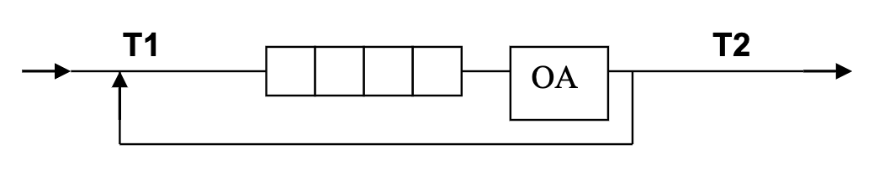
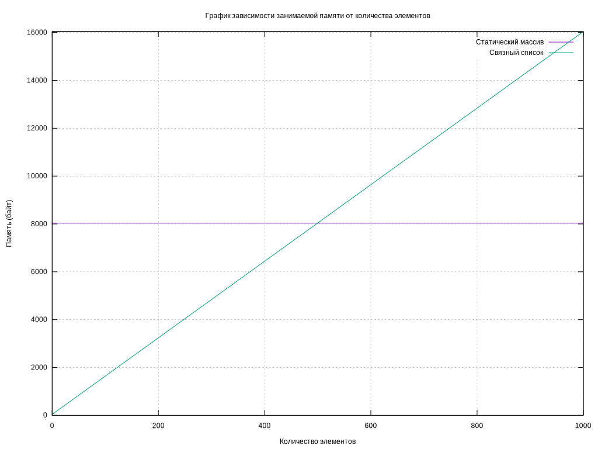

# 1. Условие

Система массового обслуживания состоит из обслуживающего аппарата
(ОА) и очереди заявок.



Заявки поступают в "хвост" очереди по случайному закону с интервалом
времени Т1, равномерно распределенным от 0 до 6 единиц времени (е.в.). В
ОА они поступают из "головы" очереди по одной и обслуживаются также
равновероятно за время Т2 от 0 до 1 е.в., Каждая заявка после ОА вновь
поступает в "хвост" очереди, совершая всего 5 циклов обслуживания, после
чего покидает систему. (Все времена – вещественного типа) В начале
процесса в системе заявок нет.
Смоделировать процесс обслуживания до ухода из системы первых 1000
заявок, выдавая после обслуживания каждых 100 заявок информацию о
текущей и средней длине очереди, а в конце процесса - общее время
моделирования и количестве вошедших в систему и вышедших из нее заявок,
количестве срабатываний ОА, время простоя аппарата. По требованию
пользователя выдать на экран адресов элементов очереди при удалении и
добавлении элементов. Проследить, возникает ли при этом фрагментация
памяти.

# 2. Описание ТЗ

## 2.1 Исходные данные и результаты

**Входные данные**

1) Значение границы интервала (неотрицательное число)
2) Целое число — номер команды (от 0 до 10; См. [Описание задачи](#22-описание-задачи-реализуемой-программой));

**Выходные данны**

1) Информация о состояни очереди во время обработки (количество элементов в очереди и среднее количество элементов в
   очереди)
2) Информация о результате моделирования (Общее время моделирования, время ожидания обработчика, количество вошедших и
   вышедших заявок, количество запусков обработчика, время работы обработчика), их погрешности относительно
   теоретических значений
3) Освобожденные из-под узлов списка адреса

## 2.2 Описание задачи, реализуемой программой

Программа реализует интерфейс для взаимодействия с симуляцией обработки очереди, позволяющий выполнить
следующие действия:

> Номер перечисления соответствует номеру команды в программе

0) Выход
1) Запустить симуляция с использованием связного списка
2) Запустить симуляция с использованием связного списка и выводом промежуточной информации
3) Запустить симуляция с использованием статического массива
4) Запустить симуляция с использованием статического массива и выводом промежуточной информации
5) Изменить время добавления заявки в очередь
6) Изменить время обработки заявки автоматом
7) Провести замеры

## 2.3 Способ обращения к программе

Взаимодействие с программой происходит через консольный интерфейс, входные данные вводятся пользователем с клавиатуры
Запуск программы из рабочей директории:

```shell
./app.exe
```

## 2.4 Описание возможных аварийных ситуаций и ошибок пользователя

Аварийные ситуации могут возникнуть только в случае невозможности выделения памяти.

> В программе предусмотренна защита от неправильного ввода, поэтому она не завершится аварийно в этом случае.

# 3. Внутренние структуры данных

> `item_t` - тип элемента очереди (в данном случае `request_t`)

Очередь на списке

```c++
struct ll_queue_
{
    list_t *body;
};

struct list_t
{
    list_node *head; // least recent added emlement
    list_node *tail; // most recent added element
};

struct list_node
{
    item_t val;
    struct list_node *next;
};
```

---

Очередь на статическом массиве

> MAX_SIZE - максимальный размер статического массива (равно 1000)

```c++
struct sa_queue_
{
    item_t body[MAX_SIZE];
    size_t n;
    item_t *tail;
    item_t *head;
};
```

---

# 4. Описание алгоритма

## Алгоритм моделирования:

Пока из очереди не вышло 1000 элементов:

- Если время для поступления нового запроса наступило:
    - Добавляется новый запрос в очередь.
    - Сбрасывается таймер для следующего поступления запроса.
    - Увеличивается счетчик поступивших запросов.
- Иначе:
    - Уменьшить таймер для следующего поступления запроса


- Если очередь не пуста и время обработки запроса наступило:
    - Извлекается первый запрос из очереди.
    - Если у запроса остались циклы на обработку, он возвращается в очередь с уменьшенным количеством циклов.
    - Если запрос завершен (циклы равны 0), увеличивается счетчик вышедших запросов.
    - Сбрасывается таймер для следующей обработки запроса.
- Иначе:
    - Уменьшить таймер для следующей обработки запроса

# 5. Основные функции

`return_code` - тип, описывающий код возврата\
`time_t_` - тип описывающий абстрактные единицы времени (в данном случае - `double`)\

```c++
return_code process_run_ll_queue_simulation(const size_t requests_limit,
                                            const time_t_ min_enterance,
                                            const time_t_ max_enterence,
                                            const time_t_ min_handle,
                                            const time_t_ max_handle);

return_code process_run_ll_queue_simulation_verbose(const size_t requests_limit,
                                                    const time_t_ min_enterance,
                                                    const time_t_ max_enterence,
                                                    const time_t_ min_handle,
                                                    const time_t_ max_handle);

return_code process_run_sa_queue_simulation(const size_t requests_limit,
                                            const time_t_ min_enterance,
                                            const time_t_ max_enterence,
                                            const time_t_ min_handle,
                                            const time_t_ max_handle);

return_code process_run_sa_queue_simulation_verbose(const size_t requests_limit,
                                                    const time_t_ min_enterance,
                                                    const time_t_ max_enterence,
                                                    const time_t_ min_handle,
                                                    const time_t_ max_handle);
                                                    
return_code process_set_eneter_timeout_interval(time_t_ *min, time_t_ *max);

return_code process_set_handle_timeout_interval(time_t_ *min, time_t_ *max);

return_code process_show_stat(void);
```

# 6. Оценка эффективности

Для каждой измеряемой операция выполнялась 1000 раз, а затем время затраченное на 1000 одинаковых операций делилось на
количество выполнений, чтобы получить время 1 операции

## Enqueue (Добавление)

| Type         | Time (nanoseconds) |
|--------------|--------------------|
| Static array | 10                 |
| Linked list  | 42                 |

---

## Dequeue (Извлечение)

| Type         | Time (nanoseconds) |
|--------------|--------------------|
| Static array | 6                  |
| Linked list  | 36                 |

---

## Затраченная память



Можно заметить, что очередь на статическом массиве выполняют операции быстрее, но при этом требует одинаковое количество
памяти вне зависимости от заполненности. До `~50%` процентов заполненности очередь на списке занимает меньше места

# 7 Сравнение LIFO и FIFO

| **Критерий**                  | **LIFO (Stack)**                  | **FIFO (Queue)**                           |
|-------------------------------|-----------------------------------|--------------------------------------------|
| **Принцип работы**            | Последний вошел — первый вышел    | Первый вошел — первый вышел                |
| **Типичная структура**        | Стек                              | Очередь                                    |
| **Применение**                | Обратные задачи, стеки вызовов    | Очереди обработки, потоки данных           |
| **Время выполнения операций** | O(1) для добавления/удаления      | O(1) для добавления/удаления               |
| **Примеры использования**     | История браузера, отмена операций | Обработка задач в ОС, очередь обслуживания |

**Заключение:** LIFO и FIFO применяются в зависимости от контекста задачи. LIFO предпочтителен, когда нужно обеспечить
доступ к последнему добавленному элементу, тогда как FIFO используется там, где важен порядок обработки данных в
последовательности их добавления.

# 8. Контрольные вопросы

## 1. Что такое FIFO и LIFO?

`FIFO (First In, First Out)` — это принцип организации данных, при котором первым добавленным элементом в структуру
данных
является первый извлекаемый. Это значит, что данные извлекаются в порядке их добавления. Очереди — типичный пример
структуры данных, работающей по принципу FIFO.

`LIFO (Last In, First Out)` — это принцип, при котором последним добавленным элементом является первый извлекаемый.
Другими словами, данные извлекаются в обратном порядке их добавления. Стек является классическим примером структуры
данных, использующей принцип LIFO.

## 2. Каким образом, и какой объем памяти выделяется под хранение очереди при различной ее реализации?

В случае реализации очереди на массиве, под нее неизбежно будет выделяться количество памяти необходимое для
максимального размера очереди, если это статический массив и максимальное количество памяти для текущей ступени
расширения, если это динамический массив. Если же очередь реализуется при помощи связного списка, то память выделятся по
мере заполнения очереди, для каждого очередного элемента.

Таким образом очередь на массиве будет занимать почти всегда больше памяти, чем действительно используется.

## 3. Каким образом освобождается память при удалении элемента из очереди при ее различной реализации?

При реализации очереди на списке память из-под элемента освобождается сразу же после его удаления. В статическом
массиве -
память не освобождается.

## 4. Что происходит с элементами очереди при ее просмотре?

При просмотре элементов очереди содержимое самой очереди остается неизменным, если не выполняются операции извлечения
или удаления. Просмотр позволяет узнать, какие элементы находятся в очереди и в каком порядке они будут извлечены, но
при этом сами элементы не удаляются и их порядок остается прежним.

Однако если осуществляется операция извлечения (например, dequeue), первый элемент очереди удаляется, и последующие
элементы сдвигаются вперед.

## 5. От чего зависит эффективность физической реализации очереди?

Зависит от:

- Времени доступа к первому и последнему элементу
- Времени изменения очереди
- Максимальный размер очереди

## 6. Каковы достоинства и недостатки различных реализаций очереди в зависимости от выполняемых над ней операций?

### Очередь на статическом массиве

**Достоинства:**

- Простой и эффективный доступ к элементам.
- Быстрое добавление/удаление (O(1)) при использовании кольцевого массива.
- Меньше накладных расходов по памяти, нет указателей.

**Недостатки:**

- Фиксированный размер, требуется перераспределение при переполнении.
- Проблемы с производительностью при сдвиге элементов (если не кольцевой буфер).

### Очередь на связном списке

**Достоинства:**

- Динамически изменяемый размер.
- Операции добавления/удаления (O(1)).

**Недостатки:**

- Дополнительные накладные расходы на хранение указателей.
- Более сложная реализация.

## 7. Что такое фрагментация памяти, и в какой части ОП она возникает?

**Фрагментация памяти** — это процесс, при котором свободное пространство в оперативной памяти делится на мелкие
фрагменты, что затрудняет эффективное использование памяти.

**Внешняя фрагментация возникает**, когда память разбивается на мелкие участки из-за выделения и освобождения блоков,
что делает невозможным выделение большого блока, несмотря на наличие свободной памяти. Это происходит в куче.

**Внутренняя фрагментация возникает**, когда выделенный блок памяти больше, чем нужно, что приводит к неэффективному
использованию пространства. Это может случиться в стеке или других областях памяти.

## 8. Для чего нужен алгоритм «близнецов».

Алгоритм «близнецов» используется для оптимизации поиска свободных блоков памяти в операционных системах, в частности
при управлении динамической памятью. Его основная цель — уменьшить фрагментацию и повысить эффективность работы с кучей.

## 9. Какие дисциплины выделения памяти вы знаете?

`First fit` - первый подходящий\
`Best fit` - лучший подхдящий

## 10. На что необходимо обратить внимание при тестировании программы?

- На соответствие функциональным требованиям
- На утечки памяти

## 11. Каким образом физически выделяется и освобождается память при динамических запросах?

**Выделение**

Когда программа запрашивает память (например, через malloc), система ищет свободный блок в куче с использованием
алгоритмов (например, `First fit`, `Best fit`). Выделяется подходящий блок. Обновляются метаданные о занятости блока.

**Освобождение**

Освобожденный блок возвращается в кучу и помечается как свободный. Система может объединять соседние свободные блоки,
чтобы уменьшить внешнюю фрагментацию.

# 9. Выводы

Очередь выгодно использовать, когда необходимо обрабатывать данные в порядке их поступления (FIFO), например, в задачах
управления процессами, планирования заданий, моделирования потоков данных, а также при реализации буферов и систем
обслуживания клиентов.

Очередь на массиве предпочтителен, если заранее известен размер данных, так как
она обеспечивает быструю индексацию.

Очередь на связном списке лучше использовать, когда размер данных может изменяться,
поскольку он более гибок и не требует перерасчета памяти, но может вызвать фрагментацию памяти.
Очередь на связном списке занимает меньше памяти, чем реализации на массиве при заполненности до `~50%`. 
